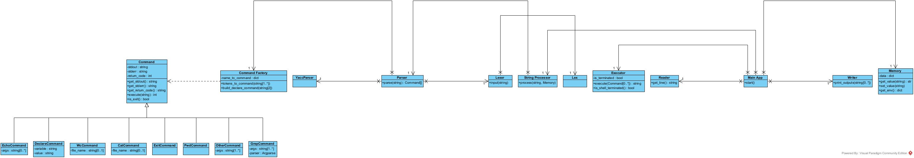

# CLI

## Сборка и запуск приложения

Необходимо установить `Python3` (тестирование производится на версии 3.9) и `pip`.

Запустить команду `pip install -r requirements.txt` для установки всех зависимостей.

Запуск тестов возможен командой `nose2`.

Чтобы запустить приложение, необходимо ввести команду `python3 app.py`.

## Схема архитектуры



## **Main App**

Отвечает за связывание компонент приложения и взаимодействие с пользователем. Содержит в себе следующие компоненты:

* `Memory` -- хранит переменные окружения
* `String Processor` -- разбивает введенную строку на список команд
* `Executor` -- выполняет последовательность команд и возвращает результат выполнения
* `Reader` -- читает пользовательский ввод
* `Writer` -- пишет в stdout и stderr

Методы:

* `start()` -- запускает приложение

В методе `start` выполняется бесконечный цикл. На каждой итерации с помощью `Reader` считывается введенная пользователем
строка. Далее эта строка передается в `String Processor`, которой выдает список команд. Далее последовательность команд
обрабатывается с помощью `Executor`, ответственного за запуск каждой команды и передачу данных между ними. После
этого `Writer` выводит в stdout результат выполнения, если такой имеется, выводит ошибки, если таковые возникли на
предыдущих шагах. На этом итерация цикла заканчивается.

Если последняя команда является `exit`, то цикл останавливается

## **Memory**

Отвечает за хранение переменных окружения.

Поля:

* `data` -- хеш-таблица, хранящая по имени переменной ее значение

Методы:

* `getValue(String name): String` -- возвращает значение переменной `name`
* `setValue(String name, String value)` -- добавляет или обновляет переменную с именем `name`, используя
  значение `value`
* `getEnv()` -- возвращает все переменные среды

При инициализации класса создается хеш-таблица, которая заполняется переменными внешнего окружения (например, с
помощью `os.environ` в Python)

## **String Processor**

Отвечает за разбиение входной строки на последовательность команд

Методы:

* `process(String input): List<Command>` -- преобразует входную строку в последовательность команд

Компоненты:

* `Formatter` -- выделяет в строке переменные и подставляет вместо них их значения
* `Parser` -- разбивает строку на последовательность команд

В методе `process` сначала в строку подставляются все переменные с помощью `Formatter` и далее разбивается на команды по
символу `|` в классе `Parser`

## **Formatter**

Отвечает за подстановку переменных во входную строку

Методы:

* `substitute(String input, Memory memory): String` -- подставляет вместо переменных их значения из `memory`. Если
  переменная отсутствует в памяти, то подставляется пустая строка.

Метод `substitute` разбивает строку на подстроки, где подстрока это либо строка, в которой все кавычки экранированы,
либо строка в одинарных или двойных кавычках. Далее в нужные подстроки подставляются значения переменных с
помощью `Template strings`. Далее конкатенирует все строки и возвращает полученную строку.

<details>
<summary>Регулярное выражение для выделения первой подстроки:</summary>

```python
r"""^((\\.)|[^\\"'])+|("((\\.)|[^\\"])*")|('((\\.)|[^\\'])*')"""
```

</details>

## **Parser**

Отвечает за разбиение входной строки на команды.

Методы:

* `split(String input): List<Command>` -- разбивает строку `input` на команды и возвращает список из них

<details>
<summary>Правила лексера:</summary>

```python

STRING_IN_QUOTES = r'''("((\\.)|[^\\"])*")|('((\\.)|[^\\'])*')'''
WORD = r'''$[a-zA-Z_][a-zA-Z_0-9]*$'''
STRING = r"""(\\[bfrnt"/\\]|[^=|\s"'\u005C\u0000-\u001F\u007F-\u009F]|\\u[0-9a-fA-F]{4})+"""
PIPE = '|'
EQUAL = '='
```

</details>

<details>
<summary>Грамматика парсера:</summary>

```
value : STRING_IN_QUOTES
      | STRING

value_sequence : value
               | value value_sequence

declaration : STRING EQUAL value

function_call : STRING
              | STRING value_sequence

command : declaration
        | function_call

pipeline : command
         | pipeline PIPE command
```

При создании `command` и `declaration` надо дополнительно проверить, что первая строка удовлетворяет регулярному
выражению `WORD`

</details>

Для разбиения строки на команды используется библиотека `yacc`. С помощью `Command Factory` полученные токены
преобразуются в команды.

(В теории токены можно обернуть в дополнительный класс, чтоб далее их проще различать, но непонятно, насколько это
оправданно, пока обходимся строками)

## **Command**

Интерфейс команд

Поля:

* `returnCode` -- код возврата
* `stdout` -- вывод команды в стандартный поток вывода
* `stderr` -- вывод в поток ошибок

Методы:

* `execute(String input)` -- выполнение команды с использованием ввода `input`
* `get*()` -- геттеры соответствующих полей
* `is_exit()` -- сообщает является ли команда командой выхода, для всех команд, кроме `ExitCommand` возвращает `False`

Далее перечислены наследники **Command**

### **DeclareCommand**

Присваивает переменной требуемое значение.

Конструктор ожидает получить 2 аргумента, первый из которых имя переменной, второе ее новое значение

`execute(String input, Memory mem)` игнорирует `input`, модифицирует окружение `mem` заданием нового значения

При успешном выполнении в `stdout` пусто

### **CatCommand**

Выводит содержимое файла.

Конструктор ожидает либо 1 аргумент, либо 0

`execute(String input)` `input` игнорируется если в конструктор был передан аргумент и в таком случае вывод это
содержимое файла. Иначе выводом считается `input`.

При успешном выполнении в `stdout` лежит результат работы `execute`.

### **EchoCommand**

Выводит переданные строки.

Конструктор принимает произвольное количество аргументов

`execute(String input)` `input` игнорируется

При успешном выполнении в `stdout` лежит строка, являющаяся соединением переданных в конструктор значений через пробел

### **WcCommand**

Считает количество строк, слов и байт в файле.

Конструктор ожидает либо 1, либо 0 аргументов

`execute(String input)` ожидает имя файла в `input`, если оно не был передан ранее, иначе игнорируется

При успешном выполнении в `stdout` лежит необходимая информация

### **PwdCommand**

Выводит текущую директорию.

Конструктор игнорирует аргументы

`execute(String input)` игнорирует `input`

При успешном выполнении в `stdout` лежит текущая директория

### **ExitCommand**

Сообщает о завершении программы.

Конструктор игнорирует аргументы

`execute(String input)` игнорирует `input`. В текущем решении ничего не делает.

`stdout` ничего не содержит

### **OtherCommand**

Выполняет стороннюю команду

Конструктор принимает один и более аргумент. Первый расценивается как имя команды, которую необходимо выполнить,
остальное ее аргументы

`execute(String input, Memory mem)` метод перегружен чтобы была возможность использовать переменные окружения (для
остальных команд перегрузки делают одно и то же, здесь перегрузка без переменных окружения скорее будет кидать
исключение). `input` считается дополнительным вводом команды. Зовется соответствующая команда. Сейчас для вызова
комманды использоуется `subprocess` (позволяет указывать окружение и получать всю нужную информацию), который позволяет
явно передать переменные окружения и позволяет получить вывод stderr, stdout и код возврата.

`stdout`, `stderr`, `returnCode` хранят соответствующие значения

### **GrepCommand**
Реализует функциональность grep.

Конструктор ожидает, что аргументы опционально содержат поддерживаемые флаги, имя файла и точно имеется регулярное выражение.

`execute(String input)` -- ищет подстроки с учетом ключей и регулярного выражения в файле, если его имя было в аргументах конструктора, иначе применяет поиск к `input`.

`stdout` содержит найденные строки.

#### Парсинг аргументов
Варианты:

* Argparse. Идет из коробки, имеет простой синтаксис, достаточно часто используется. Выбор пал на данную библиотеку приемущественно потому что имелся опыт ее использования и она всегда будет актуальна, т.к. идет вместе с Python. 
* Plac. Позволяет генерировать парсер аргументов на основе сигнатуры функций и декораторв. Для нашей ситуации не очень подходит или надо лезть глубже в документацию чтобы понять как ее заиспользовать без излишеств.
* Click. В плане синтаксиса так же похожа на Argparse, но аналогично Plac регулируется с помощью декоратора функции, которую планируется запускать, что опять же некоторая проблема в нашем случае. Но ее рекомендовали как хорошую альтернативу Argparse.
## **Command Factory**

Класс, отвечающий за преобразование предобработанных групп токенов в экземпляры класса `Command`

Поля:

* `nameToCommand` -- хеш-таблица из названия команды в конструктор соответствующей команды

Методы:
* `tokensToCommands(String commandName, List<String> args)` -- пытается создать комманду с именем `commandName`, если 
такой нет в `nameToCommand`, то конструирует `OtherCommand`
* `buildDeclareCommand(String variable, String value)` -- метод для создания команды `DeclareCommand` с переменной 
`variable` и значением `value`. Вынесение в отдельный метод обусловленно особенностью синтаксиса данной команды.

## **Executor**

Класс, отвечающий за последовательное выполнение команд.

Поля:

* `isTerminated` -- флаг о завершении выполнения всей программы

Методы:

* `execute(List<Command> commands, Memory mem)` -- идет по каждой команде и пытается выполнить ее, переменные окружения
  передаются в `mem`. Если команда завершается с ошибкой, то работа продолжается. При выполнении команды берет ее stdout
  и подает в качестве аргумента следующей команде. Если единственная переданная команда команда оказалось
  командой `exit`, то обновляет `isTerminated`. В конце возвращает весь `stderr` разделенный переносом строки и
  последний `stdout`.
* `isShellTerminated()` -- возвращает значение `isTerminated`.

## **Reader**

Класс, отвечающий за пользовательский ввод

Методы:

* `getLine(): String` -- выводит пользователю `>>>` и ждет ввода строки, которую возвращает

## **Writer**

Класс, отвечающий за вывод

Методы:

* `printOutputs(String stdout, String stderr)` -- выводит пользователю строки `stdout` и `stderr`

Можно расширять для перенаправления вывода (если дальше потребуется)
