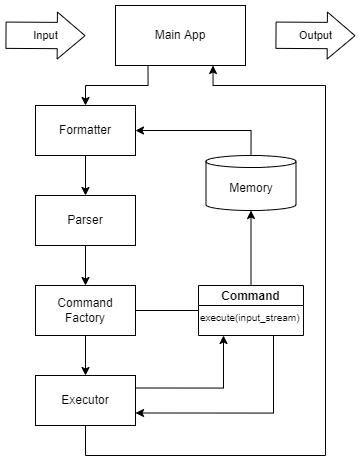

# CLI

## Сборка и запуск приложения
Необходимо установить `Python3` (тестирование производится на версии 3.6.9) и `pip`.

Запустить команду `pip install -r CLI/requirements.txt` для установки всех зависимостей.

Запуск тестов возможен командой `nosetest CLI`.

Чтобы запустить приложение необходимо ввести команду `python3 app.py`.

## Схема архитектуры



## **Main App**
Отвечает за связывание компонент приложения и взаимодействие с пользователем. Содержит в себе следующие компоненты:
* `Memory` -- хранит переменные окружения
* `String Processor` -- разбивает введенную строку на список команд 
* `Executor` -- выполняет последовательность команд и возвращает результат выполнения
* `Reader` -- читает пользовательский ввод
* `Writer` -- пишет в stdout и stderr

Методы:
* `start()` -- запускает приложение
* `interrupt()` -- останавливает выполнение

В методе `start` выполняется бесконечный цикл. На каждой итерации с помощью `Reader` считывается введенная пользователем строка. Далее эта строка передается в `String Processor`, которой выдает список команд.
Далее последовательность команд обрабатывается с помощью `Executor`, ответственного за запуск каждой команды и передачу данных между ними. После этого `Writer` выводит в stdout результат выполнения, если такой имеется, выводит ошибки, если таковые возникли на предыдущих шагах. На этом итерация цикла заканчивается. 

Если последняя команда является `exit`, то цикл останавливается

<!--
который подставляет в токены переменные окружения, склеивает токены, если между ними нет пробела (пример с exit из презентации), разбивает на группы по символу `|` в качестве разделителя. Полученные группы токенов подаются `Command Factory`, 
которая на их основе создает потомков класса `Command`. Далее последовательность команд обрабатывается с помощью `Executor`, ответственного за запуск каждой команды и передачу данных между ними. После этого `Writer` выводит в stdout результат выполнения, если такой имеется, выводит ошибки, если таковые возникли на предыдущих шагах. На этом итерация цикла заканчивается. Выполнение команды `exit` прерывает цикл, информация об этом берется из `Executor` по окончании его работы.
-->

## **Memory**
Отвечает за хранение переменных окружения.

Поля:
* `data` -- хеш-таблица, хранящая по имени переменной ее значение

Методы:
* `hasValue(String name): Bool` -- возвращает информацию о том, есть ли переменная `name`
* `getValue(String name): String` -- возвращает значение переменной `name`
* `setValue(String name, String value)` -- добавляет или обновляет переменную с именем `name`, используя значение `value`

При инициализации класса создается хеш-таблица, которая заполняется переменными внешнего окружения (например, с помощью `os.environ` в Python)

## **String Processor**
Отвечает за разбиение входной строки на последовательность команд

Методы:
* `process(String input): List<Command>` -- преобразует входную строку в последовательность команд

Компоненты:
* `Formatter` -- выделяет в строке переменные и подставляет вместо них их значения
* `Parser` -- разбивает строку на последовательность команд 

В методе `process` сначала в строку подставляются все переменные с помощью `Formatter` и далее разбивается на команды по символу `|` в классе `Parser`  

## **Formatter**
Отвечает за подстановку переменных во входную строку

Методы:
* `substitute(String input, Memory memory): String` -- подставляет вместо переменных их значения из `memory`. Если переменная отсутствует в памяти, то подставляется пустая строка.

Метод `substitute` разбивает строку на подстроки, где подстрока это либо строка, где в которой все кавычки экранированы, либо строка в одинарных или двойных кавычках.
Далее в нужные подстроки подставляются значения переменных с помощью `Template strings`. Далее конкатенирует все строки и возвращает полученную строку. 

<details>
<summary>Регулярное выражения для выделения первой подстроки:</summary>

```python
r"""^((\\.)|[^\\"'])+|("((\\.)|[^\\"])*")|('((\\.)|[^\\'])*')"""
```

</details>

## **Parser**
Отвечает за разбиение входной строки на команды.

Методы:
* `split(String input): List<Command>` -- разбивает строку `input` на команды и возвращает список из них

<details>
<summary>Правила лексера:</summary>

```python

STRING_IN_QUOTES = r'''("((\\.)|[^\\"])*")|('((\\.)|[^\\'])*')'''
WORD = r'''$[a-zA-Z_][a-zA-Z_0-9]*$'''
STRING = r"""(\\[bfrnt"/\\]|[^=|\s"'\u005C\u0000-\u001F\u007F-\u009F]|\\u[0-9a-fA-F]{4})+"""
PIPE = '|'
EQUAL = '='
```
  
</details>

<details>
<summary>Грамматика парсера:</summary>

```
value : STRING_IN_QUOTES
      | STRING

value_sequence : value
               | value value_sequence

declaration : STRING EQUAL value

function_call : STRING
              | STRING value_sequence

command : declaration
        | function_call

pipeline : command
         | pipeline PIPE command
```
При создании `command` и `declaration` надо дополнительно проверить, что первая строка удовлетворяет регулярному выражению `WORD`

</details>

Для разбиения строки на команды используется библиотека `yacc`. С помощью `Command Factory` полученные токены преобразуются в команды.

(В теории токены можно обернуть в дополнительный класс, чтоб далее их проще различать, но непонятно на сколько это оправданно, пока обходимся строками)

## **Command**
Интерфейс команд

Поля:
* `returnCode` -- код возврата
* `stdout` -- вывод команды в стандартный поток вывода
* `stderr` -- вывод в поток ошибок

Методы:
* `execute(String input)` -- выполнение команды с использованием ввода `input`
* `get*()` -- геттеры соответствующих полей

Далее перечислены наследники **Command**

### **DeclareCommand**
Присваивает переменной требуемое значение.

Конструктор ожидает получить 2 аргумента, первый из которых имя переменной, второе ее новое значение

`execute(String input, Memory mem)` игнорирует `input`, модифицирует окружение `mem` заданием нового значения

При успешном выполнении в `stdout` пусто

### **CatCommand**
Выводит содержимое файла.

Конструктор ожидает либо 1 аргумент, либо 0

`execute(String input)` `input` игнорируется если в конструктор был передан аргумент и в таком случае вывод это содержимое файла. Иначе выводом считается `input`.

При успешном выполнении в `stdout` лежит результат работы `execute`.

### **EchoCommand**
Выводит переданные строки.

Конструктор принимает произвольное количество аргументов

`execute(String input)` `input` игнорируется

При успешном выполнении в `stdout` лежит строка, являющаяся соединением переданных в конструктор значений через пробел

### **WcCommand**
Считает количество строк, слов и байт в файле.

Конструктор ожидает либо 1, либо 0 аргументов

`execute(String input)` ожидает имя файла в `input`, если оно не был передан ранее, иначе игнорируется

При успешном выполнении в `stdout` лежит необходимая информация

### **PwdCommand**
Выводит текущую директорию.

Конструктор игнорирует аргументы

`execute(String input)` игнорирует `input`

При успешном выполнении в `stdout` лежит текущая директория

### **ExitCommand**
Сообщает о завершении программы.

Конструктор игнорирует аргументы

`execute(String input)` игнорирует `input`. В текущем решении ничего не делает.

`stdout` ничего не содержит 

### **OtherCommand**
Выполняет стороннюю команду

Конструктор принимает один и более аргумент. Первый расценивается как имя команды, которую необходимо выполнить, остальное ее аргументы

`execute(String input, Memory mem)` метод перегружен чтобы была возможность использовать переменные окружения (для остальных команд перегрузки делают одно и то же, здесь перегрузка без переменных окружения скорее будет кидать исключение). `input` считается дополнительным вводом команды. Зовется соответствующая команда. Сейчас для вызова комманды использоуется `subprocess` (позволяет указывать окружение и получать всю нужную информацию), который позволяет явно передать переменные окружения и позволяет получить вывод stderr, stdout и код возврата.

`stdout`, `stderr`, `returnCode` хранят соответствующие значения 

## **Command Factory**
Класс, отвечающий за преобразование предобработанных групп токенов в экземпляры класса `Command`

Поля:
* `nameToCommand` -- хеш-таблица из названия команды в конструктор соответствующей команды

Методы:
* `tokensToCommands(String commandName, List<String> args)` -- пытается создать комманду с именем `commandName`, если 
такой нет в `nameToCommand`, то конструирует `OtherCommand`
* `build_declare_command(String variable, String value)` -- метод для создания команды `DeclareCommand` с переменной 
`variable` и значением `value`. Вынесение в отдельный метод обусловленно особенностью синтаксиса данной команды.

## **Executor**
Класс, отвечающий за последовательное выполнение команд.

Поля:
* `isTerminated` -- флаг о завершении выполнения всей программы

Методы:
* `execute(List<Command> commands, Memory mem)` -- идет по каждой команде и пытается выполнить ее, переменные окружения передаются в `mem`. Если команда завершается с ошибкой, то работа продолжается. При выполнении команды берет ее stdout и подает в качестве аргумента следующей команде. Если единственная переданная команда команда оказалось командой `exit`, то обновляет `isTerminated`. В конце возвращает весь `stderr` разделенный переносом строки и последний `stdout`.
* `isShellTerminated()` -- возвращает значение `isTerminated`.

## **Reader**
Класс, отвечающий за пользовательский ввод

Методы:
* `getLine(): String` -- выводит пользователю `>>>` и ждет ввода строки, которую возвращает

## **Writer**
Класс, отвечающий за вывод

Методы:
* `printOutputs(String stdout, String stderr)` -- выводит пользователю строки `stdout` и `stderr`

Можно расширять для перенаправления вывода (если дальше потребуется)

<!--
## **Formatter**
Класс, отвечающий за форматирование последовательности токенов и разбиение их на команды

Методы:
* `process(tokens, memory)` -- сначала проходится по всем токенам и для каждого токена, начинающегося с `$`, заменяет его на значение из `memory`, для каждого токена, начинающегося с `"` проходится по внутренности и делает аналогичные подстановки с `$`, если токен это `=`, то считаем присваивание корректным лишь если нам подали 3 токена на вход, при этом справа и слева некоторая строка, в противном случае кидаем исключение (разрешаем одно присваивание и только его за одну команду пользователя для простоты). 
Если во время подстановки оказывается, что нужной переменной нет, то кидается исключение, сообщающее об этом. Параллельно с проходом подстановки можно бить токены по группам, используя в качестве разделителя `|`, если токены `|` идут подряд, то кидается исключение, говорящее об ошибке. Затем по каждой группе идет еще один проход, объединяющий токены, между которыми не было пробела (пример с exit из презентации), кроме того пробельные токены исключаются за дальнейшей ненадобностью


`Main App` object contains `Memory` field for keeping variables values. `Memory` is a key-value storage.

Then the string is parsed by a finite-state machine in `Formatter`, which substitutes variables with their values taken from `Memory`, skipping the substitution in single quotes

The string is passed to the `Parser`, which splits the string into tokens and passes the resulting sequence (syntax tree if we need to support brackets, for now it seems much easier to use a list of commands) to the `Command Factory`.

`Command Factory` creates a descendant of the `Command` class for each element of parsed sequence (or for each node of the syntax tree if we use one). Each `Command` object contains `execute` method for performing corresponding operation and takes required arguments (e.g. `Cat`'s `execute` method takes name of file and outputs provided file content)

The tree is passed to the `Executor`, which sequentially calls all nodes with the `execute` method using provided arguments, passing the output to the following nodes as their input 

The resulting output or error messages returns to the `Main App`, where it further output to the user. -->
