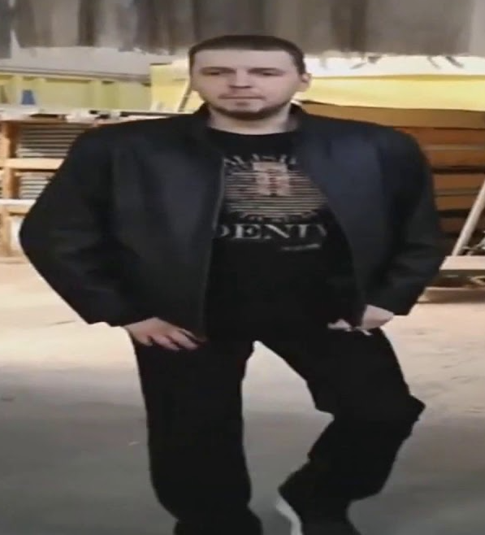
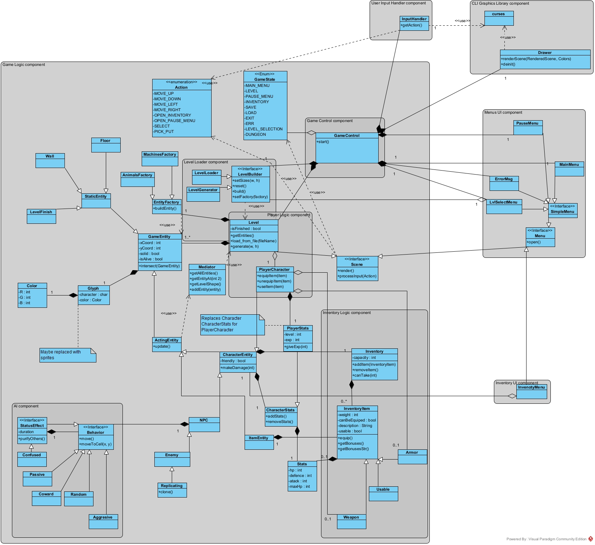

# Dune Rogue

## Общие сведения о системе

### Назначение системы
Система представляет из себя игру жанра Roguelike в сеттинге вселенной "Дюна" Фрэнка Герберта.
Система служит для развлечения пользователя.

### Границы системы
* Игра является однопользовательской.
* Консольная графика с плоским "видом сверху".
* Игрок управляет своим персонажем при помощи клавиатуры. 
* Игра побита на уровни. 
Каждый уровень представляет из себя двумерную сетку, в каждой ячейки которой может распологаться какая-то из игровых сущностей.
* Пользователь имеет возможность в любой момент сохранить свой прогресс, чтобы остановить игру, 
но сохранение затирает предыдущее, и после смерти персонажа сохранение удаляется.

### Контекст
* Поддержка платформ Windows и Linux (работоспособность под MacOS будет проверяться лишь запуском тестов).
* Установка будет произодится путем клонирования репозитория с GitHub и выполнения инструкций по установке.

## Architectural drivers

### Технические ограничения
* Необходимо использовать кроссплатформенные технологии, чтобы система поддерживалась на целевых системах.
### Бизнес-ограничения
* Сроки реализации очень небольшие. Поэтому использование неизвестных команде технологий или долгое планирование является проблематичным.
* У проекта нет финансирования, поэтому нет возможности использовать платное ПО, которым на данный момент команда не обладает.

### Качественные характеристики системы
* Система должна быть хорошо расширяемой, т.к. с течением времени необходимо будет реализовать новый функционал, который
нельзя спрогнозировать заранее. Важна структура проекта.
* Необходимо учитывать, что может придти человек извне реализовывать новую функциональность.
* Корректность работы важна, но не является критической.
* От системы не требуется высокой производительности в силу ее предполагаемой вычислительной простоты.
* Нет предпосылок к тому, чтобы в дальнейшем сопровождать систему.
* Не предпологается, что пользователи будут модифицировать систему самостоятельно.
* Не предполагается хранение и использование пользовательских данных, поэтому вопрос безопасности неактуален.

### Ключевые функциональные требования
* В игре должно быть взаимодействие персонажа, управляемого игроком, с другими сущностями 
(сражение с врагами, инвентарь, перемещение по миру).
* Должна быть возможность сохранять прогресс.
* Программа должна работать через терминал.
* Управление должно осуществлятся при помощи клавиатуры.

## Роли и случаи использования
### Роли
* Пользователь (игрок).
* Программист извне, который пришел в наш проект делать новую функциональность.
### Случаи использования
* Пользователь хочет сыграть в игру. При этом не хочется останавливать сеанс игры где-то по-середине уровня, т.е. они не должны быть слишком большими.
* Программист пришел и ему дали задачу X. Ему хочется поверхностно ознакомится со всей системой и более подробно с частью
системы, связанной с X. Для облегчения его участи необходима хорошая документация системы и комментарии в коде. 
### Типичный пользователь
Имя: Виталий Цаль

Возраст: 33 года

Фото: 

Виталий -- ведущий разработчик в компании Hidden Pool. Преимущественно работает под операционной системой семейства Linux.
У Виталия крайне плотный график, но иногда в промежутках между встречами и решением рабочих задач он хочет немного 
отвлечься и отдохнуть. Когда-то давно он читал "Дюну" Фрэнка Герберта, терминала и сложностей roguelike жанра Виталий не боится,
поэтому "Dune Rogue" будет отличным решением, чтобы пару раз за день отвлечься от работы минут на 5-10 или провести досуг 
уже после окончания рабочего дня. 

## Композиция

### User Input Handler
Отвечает за считывание пользовательского ввода 

### Game Logic
Подсистема, состоящая из компонент ответсвенных за логику и процесс игры

#### Level Generator/Loader
Компонента(ы) отвечающая за генерацию/загрузку уровней игры

#### AI Logic
Компонента регулирующая поведение неподконтрольных игроку игровых сущностей

#### Inventory Logic
Компонента отвечающая за взаимодействие пользователя с инвентарем

#### Player Logic
Компонента обработки действий игрока

#### Game Control
Компонента, связывающая остальные компоненты игровой логики.

### UI
Подсистема, ответственная за отрисовку игры

#### Game World
Отрисовка игрового мира и интерфейса игрока

#### Menus
Отрисовка меню

#### Inventory
Отрисовка инвентаря

### CLI Graphics Library
Сторонняя библиотека помогающая с выводом графики в консоль

## Логическая структура
Стиль: Model-View-Control.

Схема будет меняться по ходу реализации, сейчас это примерный план без всех подробностей

### Color
RGB представление цвета.

### Glyph
Символы для отресовки объектов, хранят в себе сам символ `character` и его цвет `color`. 

### Stats
Значения статистик. Включает в себя различные показатели типа здоровья, защиты и т.п.

### CharacterStats
Статистика персонажей, которая может меняться методами `add/removeStats` при использовании предметов или получении урона.

### PlayerStats
Расширение `CharacterStats`, позволяющее производить прокачку персонажа. 

### InventoryItem
Базовый класс предметов в инвенторе. Имеет вес `weight`, флаг о возможности экипировки на персонажа `canBeEquiped`, 
описание предмета `description`, флаг о возможности использования `usable` и характеристики для предмета `Stats`, 
которые применяются к персонажу, если он надевает/использует предмет. Методы `equip` и `use` отвечают за использование предмета.
Метод `getBonuses` возвращает статистики, которые дает предмет. 

Далее можно строить иерархию предметов, например оружие и броня, как показано на схеме   

### Inventory
Инвентарь персонажа. Хранит в себе объекты `InventoryItems`. Имеет поле `capacity`, ограничивающее переносимый вес. 
Методы `add/removeItem` отвечают за добавление и удаление предметов из инвенторя, метод `canTake` говорит можно ли взять
переданный в аргументе вес. 

### GameEntity
Родительский класс всех игровых сущностей (персонажей, элементов карты, предметов). Содержит поля координат `x/yCoord`,
символ для отрисовки `glyph` (можно заменить какими-то спрайтами при желании),
флаг можно ли наступать на данный объект `solid` (например через стены ходить нельза, а по полу можно) и флаг
существует ли данный объект `isAlive` (например когда побеждаем противника, он перестает существовать). 
Метод `intersect` отвечает за обработку события пересечения с другим объектом (например хотим подбирать предметы) 

### StaticEntity
Наследник `GameEntity`, является родительским классом для сущностей, которые никак не меняются от кадра к кадру 
(как пример приведены обычные стены и полы `Wall`, `Floor`).

### ActingEntity
Наследник `GameEntity`, является родительским классом для сущностей, которые могу действовать. Имеют метод `update`, 
который срабатывает на каждом обновлении кадра.

### Character 
Наследник `ActingEntity`, представляет из себя персонажей игры. Содержит статистики персонажа `CharacterStats`, 
его инвентарь `Inventory` и флаг является ли персонаж врагом. Метод `makeDamage` обрабатывает поступающий урон. 
На схеме показан пример как от данного класса можно насследовать врагов

### PlayerCharacter
Наследник `Character`, представляющий из себя персонажа игрока. На данный момент отличее лишь в замене `CharacterStats` 
на `PlayerStats`.

### EntityFactory
Набор методов для создания нужных сущностей.

### Scene
Интерфейс, наследники которого умеют представлять себя в формате необходимом для вывода на экран (`render`) и 
обрабатывать ввод пользователя (`processInput`).

### Menu
Интерфейс для представлений меню, наследник `Scene`. Метод `open` отвечает за установку состояния при открытии. 
Сейчас предполагаются singleton наследники `InventoryMenu`, `PauseMenu`, `MainMenu`
отвечающие за меню инвернторя, паузы и главного экрана соответсвенно.

### Level
Объект для представления уровня, наследник `Scene`. Хранит в себе список сущностей `GameEntity`. 
Метод `update` вызывает у всех активных сущностей `update`. 
Отдельно хранит ссылку на персонажа игрока. Флаг `isFinished` говорит о завершенности уровня.

### LevelLoader
Умеет грузить следующий по запросу.

### FrameBuilder
Класс отвечающий за отрисовку сцены. Пока никаких подробностей нет, т.к. зависит от выбранной библиотеки.

### Action
Перечисление действий пользователя.

### InputHandler
Обработчик пользовательского ввода, преобразует ввод с клваиатуры в элементы `Action`.

### GameState
Перечисление состояний игры. Игрок может находится в каком-то меню или на игровой карте,
в зависимости от этого активны разные сущности. Каждая сущность после обработки очередного действия возвращает новое состояние.

### GameControl
Класс связывающий остальные вместе и запускающий цикл программы. Хранит текущее состояние и в зависимости от него
дает управление той или иной `Scene`. Умеет сохранять или загружать игру, если состояние `SAVE/LOAD`.   

## Взаимодействия и состояния
### Состояния игры

При запуске игры игрок находится в состоянии Main Menu и видит главное меню. Из главного меню он может завершить программу,
выбрав соответсвующую опцию. При выборе New Game или Load Game игрок начинает новую игру и попадает в состояние Level 
или загружает последнее сохранение и, проходя через состояние Load, также попадает в состояние Level.
Состояние Level представляет из себя игровую карту уровня, где игрок управляет персонажем. При нажатии кнопки открытия
инвенторя происходит переход в состояние Inventory, где игрок пользуется инвентарем, при нажатии кнопки закрытия инвернторя
приложение возвращается в состояние Level. При нажатии кнопки открытия меню пазу происходит переход в состояние Pause Menu, 
из этого состояния можно перейти в Main Menu, выбрав соответсвующую опцию, можно просто вернутся к игре, 
выбрав пункт продолжить, а можно выбрать опцию сохранения игры, которая проходя состояние Save, отвечающее за сохранение,
вернет программу в состояние Level.

### Последовательность

Пример последовательности одной итерации игры, когда на пользователь не совершил действие, переводящее игру из состояния 
Level в другое и не приведшее к завершению уровня. 