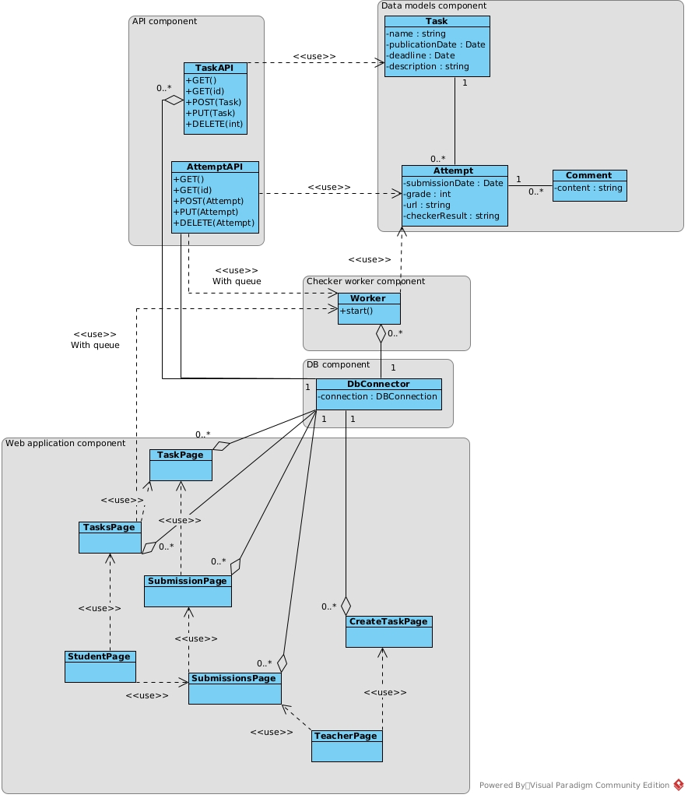

# Архитектура
## Диаграмма классов
Почти у всех классов в фрейморке есть базовый класс, на схеме они не отображены для компактности и особого смысла их указывать нет.

Приложение разбито на 5 компонент:
1. **Data Models**. Комонента отвечающая за представления данных, которые хранятся в БД.
2. **DB**. Комонента отвечающая за предоставление доступа к БД.
3. **Checker worker**. Компонента работника для проверки посылок.
4. **Web Application**. Компонента веб приложения.
5. **API**. Компонента API.

### Data Models
#### Task
Класс ответсвенный за представление задачи. Содержит в себе название, описание, даты публикации и дедлайна.
#### Attempt
Класс ответсвенный за представление попытки сдачи. Содержит в себе дату и время отправки, оценку, отправленную ссылку на решение, результат автоматической проверки. Так же содержит ссылку на задание к которому относится (сделано в такой маннере из-за работы с БД).
#### Comment 
Класс ответсвенный за представление комментария к попытке. Содержит в себе текст комментария и ссылку на попытку (сделано в такой маннере из-за работы с БД).

### DB
#### DBConnector
Устонавливает подключение к базе данных и позволяет остальным частям приложения взаимодейстовать с ней.

### Checker worker
#### Worker
Класс обработчик посылок. Запускается и ждет сообщений из очереди. Сообщение представляет из себя id посылки, которую надо проверить.

Обработка происходит следующим образом: берется ссылка из посылки (предполагается, что мы даем ссылку на файл, который скачается, из задания не очень понятно что именно хочется),
скачивается соответсвующий файл. Далее путь к скаченному файлу вместе с информацией о посылке передается в bash скрипт, который производит всю нужную проверку. 
Полученный вывод скрипта сохраняется в посылку. Т.е. чтобы провести желаему проверку необходимо лишь поменять bash скрипт.  

### Web Apllication
В данной компоненте располагаются классы, которые отвечают за обработку той или иной страницы приложения. Их названия соответсвуют требуемому интерфейсу, навигация частично показана стрелками.
Как-то подробно расписывать каждый класс нет необходимости.

### API
Содержит 2 класса обработчика Rest API для задач и попыток сдачи.